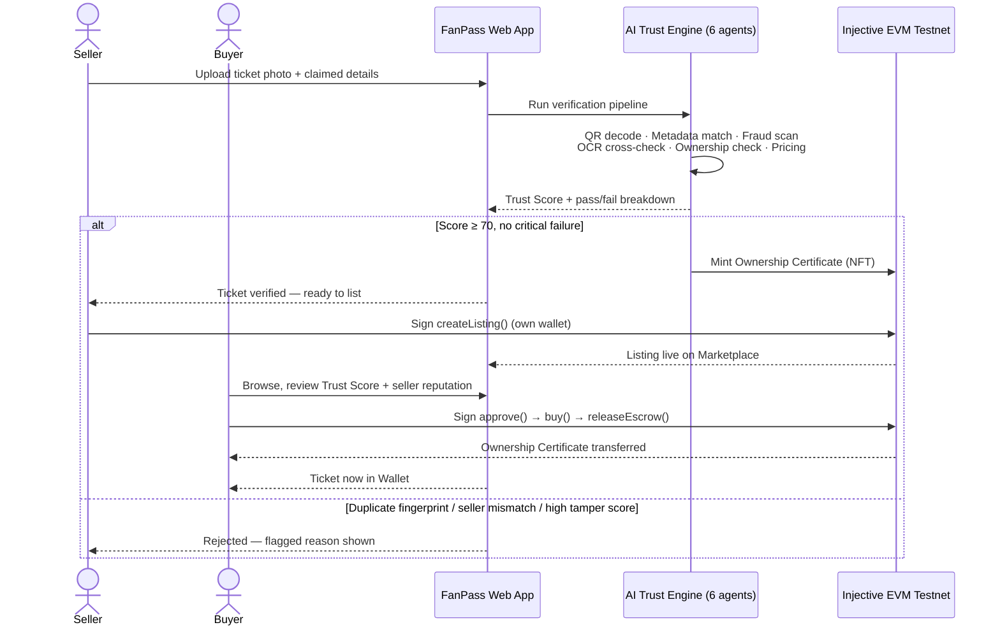
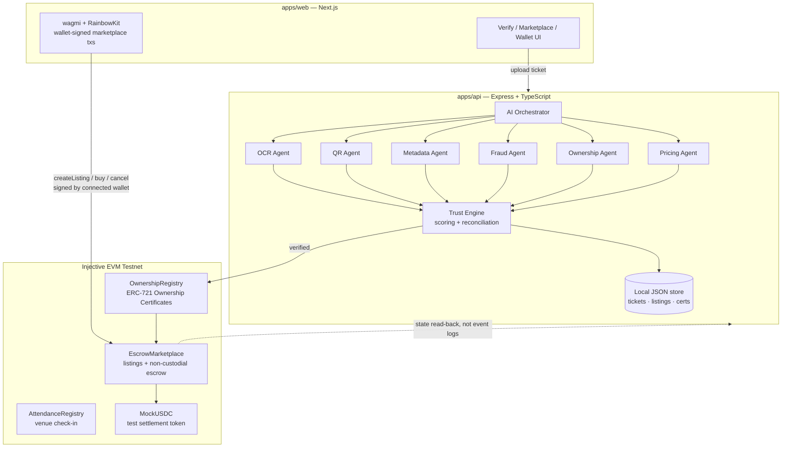

<p align="center">
  
</p>

# FanPass

**An AI-powered Trust Network for peer-to-peer World Cup ticket resale.**

Not an NFT marketplace, not a chatbot wrapper. FanPass sells one thing: certainty that the ticket you're
buying is real, unique, and actually owned by the person selling it — with blockchain and AI working
invisibly underneath, not as a headline feature.

- **Live app:** [fanpass-web-six.vercel.app](https://fanpass-web-six.vercel.app)
- **Live API:** [fanpass-api-production.up.railway.app](https://fanpass-api-production.up.railway.app/api/v1/health)
- **Pitch deck:** [Google Slides](https://docs.google.com/presentation/d/1n7nGFLU2GACDHfnCQfgluCspHOucx0Rk2ji_MUftGeg/edit?usp=sharing)
- **Demo video:** [youtu.be/TPXNdKu29Sk](https://youtu.be/TPXNdKu29Sk?si=bFND3GyqXZ_D8cc_)

---

## The problem

Every major ticketed event — and the 2026 World Cup will be the largest ticketed event in history — spawns
a shadow resale market that runs almost entirely on trust falling apart:

- **Duplicated tickets.** A screenshot or PDF gets sold to five different buyers; only one of them gets into
  the stadium.
- **Forged or altered tickets.** Seat numbers, dates, or venues edited in an image editor, sold to buyers who
  have no way to check.
- **No recourse.** Peer-to-peer resale today is a wire transfer and a prayer — if the ticket's fake, the
  money's already gone.
- **No price signal.** Buyers can't tell a fair resale price from a scalped one, so they either overpay or
  walk away from a legitimate deal.

None of this is solved by "put it on the blockchain" alone — an NFT is only as trustworthy as the process
that minted it. The actual problem is upstream: **verifying that a ticket is real *before* anything gets
tokenized or paid for.**

## The solution

FanPass puts a **6-agent AI Trust Engine** in front of every ticket, and only mints an on-chain **Ownership
Certificate** once that ticket passes. From there, buying and selling happens through a **non-custodial
escrow contract** — FanPass's backend never touches anyone's money, and never signs a marketplace
transaction on a user's behalf.

| What buyers get | What sellers get |
|---|---|
| A visible, explainable Trust Score (0–100) for every listing — not a black-box "verified" checkmark | A single AI verification pass that turns a photo into a tradeable, on-chain-backed asset |
| Duplicate/fraud detection that runs *before* money moves, not after | Fair-price guidance from real comps, not guesswork |
| Funds held in escrow until the trade actually completes | Reputation that compounds — trust score grows with a clean sales history |

---

## How it works (end to end)



**In plain terms:**

1. **Verify** — a seller uploads a photo of their ticket. Six AI agents independently check it: does the QR
   code actually decode, has this exact ticket already been submitted before, does the claimed event match a
   real fixture, does the image show signs of tampering, does the claimed seller match the on-chain owner of
   record, and is the asking price in a fair range. Every check is shown to the user — nothing is hidden
   behind a single "trust us" badge.
2. **Mint** — only if verification passes does FanPass mint an on-chain **Ownership Certificate** (an ERC-721
   token) to the seller's wallet. This is the one and only source of truth for "who owns this ticket" from
   this point forward.
3. **List** — the seller signs their own `createListing` transaction directly against the marketplace
   contract. FanPass's backend never holds or signs this.
4. **Buy** — a buyer reviews the listing's Trust Score and the seller's reputation, then signs up to three
   transactions themselves: approve USDC spend, lock funds in escrow, release escrow. Funds sit in the smart
   contract, never in a FanPass-controlled wallet, until the trade actually completes.
5. **Own** — the Ownership Certificate transfers atomically with the fund release. The ticket now shows up in
   the buyer's Wallet, fully verifiable on-chain.

Trying to re-submit a ticket that's already been verified (same QR fingerprint) is caught by the same
pipeline and rejected — that's not a bug, it's the fraud check working as intended.

---

## Architecture



**Why state reads, not event logs, for chain sync:** the public Injective Testnet RPC's transaction/receipt
and log indexes (`eth_getTransactionReceipt`, `eth_getLogs`) proved unreliable in practice — confirmed
transactions were sometimes unfindable by hash for minutes. Nonce progression and direct contract-state
reads (`listingOf`, `getListing`, `getEscrow`) never failed, so that's what the whole system is built on:
confirmation by polling the sender's nonce, and marketplace sync by reconciling against current on-chain
state rather than decoding what one specific transaction changed.

### Monorepo layout

```
apps/web         Next.js frontend — Landing, Verify Ticket, Marketplace, Wallet
apps/api         Express + TypeScript backend — Trust Engine, AI Orchestrator, local JSON store
apps/contracts   Solidity contracts (Hardhat) — deployed to Injective EVM Testnet
packages/shared  Types + Zod schemas shared between web and api — one schema, enforced on both ends
```

### The 6-agent Trust Engine

| Agent | What it checks | Real or deterministic-mock (MVP) |
|---|---|---|
| **OCR** | Extracted ticket fields vs. the seller's claimed fields | Deterministic mock, real Vision OCR planned |
| **QR** | Decodes the actual QR code in the image; flags duplicate fingerprints already on file | **Real** — `jimp` + `jsqr` |
| **Metadata** | Claimed event/venue/date against a known-fixtures table | Real lookup against fixture data |
| **Fraud** | Tamper/editing-artifact/screenshot detection | Deterministic mock, real image-forensics model planned |
| **Ownership** | Claimed seller vs. the wallet actually holding the Ownership Certificate | **Real** — checked against live store state |
| **Pricing** | Fair-price band from other active listings for the same event | Real comps-based calculation |

A ticket only becomes `verified` (and only then gets its Ownership Certificate minted) when its Trust Score
is ≥ 70 **and** none of the critical-failure conditions trip: a duplicate QR fingerprint, a seller who
doesn't match the on-chain owner of record, or a tamper score so high it can't be explained away.

---

## Deployed contracts (Injective EVM Testnet)

Chain ID `1439` · RPC `https://k8s.testnet.json-rpc.injective.network/` · Explorer:
[testnet.blockscout.injective.network](https://testnet.blockscout.injective.network)

| Contract | Address | Verify on-chain |
|---|---|---|
| **OwnershipRegistry** | `0xa05aaa4931706010A1e9089f8E12B9A5c1cA400d` | [View on Blockscout](https://testnet.blockscout.injective.network/address/0xa05aaa4931706010A1e9089f8E12B9A5c1cA400d) |
| **EscrowMarketplace** | `0x69fF99DeF5B4c023f796b3a676a6B663c8307990` | [View on Blockscout](https://testnet.blockscout.injective.network/address/0x69fF99DeF5B4c023f796b3a676a6B663c8307990) |
| **AttendanceRegistry** | `0x0637ec0842009EA4fa3b900576d70D3423994175` | [View on Blockscout](https://testnet.blockscout.injective.network/address/0x0637ec0842009EA4fa3b900576d70D3423994175) |
| **MockUSDC** (testnet only) | `0x72803FA50A1deb16AEc66677F81C16bfc2708da8` | [View on Blockscout](https://testnet.blockscout.injective.network/address/0x72803FA50A1deb16AEc66677F81C16bfc2708da8) |

51 passing tests (unit, integration, and security — including a reentrancy-attack test), full design
rationale in [`docs/PHASE_4_BLOCKCHAIN_ARCHITECTURE.md`](./docs/PHASE_4_BLOCKCHAIN_ARCHITECTURE.md).

`VERIFIER_ROLE` and `VENUE_VERIFIER_ROLE` are currently held by the deployer wallet; see §9.1 of that doc for
how to split them onto separate signers without redeploying.

---

## Tech stack

- **Frontend** — Next.js, React, Tailwind + shadcn/ui, wagmi + RainbowKit, TanStack Query
- **Backend** — Express, TypeScript, Zod, viem
- **Contracts** — Solidity, Hardhat, OpenZeppelin, deployed to Injective EVM Testnet
- **Identity** — a connected EVM wallet address *is* the user profile; no login, no separate auth system
- **Hosting** — Vercel (web), Railway (API)

### Why Injective, specifically

FanPass doesn't just deploy "on a chain" — it's built against pieces of the Injective stack that map
directly onto problems a resale market actually has:

| Injective piece | What we use it for | Why it makes FanPass better |
|---|---|---|
| **Injective EVM (MultiVM)** | `apps/contracts` ships plain Solidity (Hardhat + OpenZeppelin) straight to Injective's EVM execution layer | No custom VM, no bespoke tooling — the same wallets (MetaMask/RainbowKit), the same `viem`/`wagmi` stack, and the same audit patterns the rest of the industry already trusts, on top of Injective's faster, cheaper base layer |
| **Sub-second finality, low fixed gas** | Every write (`createListing`, `approve`, `buy`, `releaseEscrow`) is a legacy tx forced to `gasPrice = 200 gwei` (see `packages/shared/src/constants/chain.ts`) | A ticket sale is a live, time-pressured negotiation — buyers won't wait minutes or pay unpredictable gas spikes to lock in a seat. Fast, predictably-priced finality is what makes "sign three transactions and get your ticket" feel instant instead of risky |
| **State reads over event-log indexing** | Marketplace sync polls `listingOf` / `getListing` / `getEscrow` directly instead of relying on `eth_getLogs` (§Architecture above) | Turns an unreliable public-RPC log index into a non-issue — the system is built around what Injective's endpoint is actually reliable at, not around what a generic EVM chain is assumed to support |
| **Blockscout explorer (testnet.blockscout.injective.network)** | Every deployed contract links out to a live, human-readable explorer view | Buyers and sellers don't have to trust FanPass's word for "this is on-chain" — the Ownership Certificate, the escrow, the attendance record are independently verifiable by anyone, which is the whole point of a trust product |
| **Circle CCTP over Injective's USDC rail** *(Phase 5, designed)* | Cross-chain buyers burn USDC on their own chain and mint natively on Injective before `EscrowMarketplace.buy()` runs | Removes the single biggest friction in a *global* resale market — "I don't hold USDC on the right chain" — without FanPass ever custodying a bridge or a wrapped asset |
| **x402 micropayments** *(Phase 5, designed)* | Pay-per-use premium verification tiers settled directly over Injective, instead of a subscription | Fits how tickets are actually bought — a handful of times a year — so users pay for extra assurance only when they need it |

The common thread: every Injective-specific choice traces back to something an ordinary EVM deployment
either can't do cheaply enough (fast, low-cost finality for a live marketplace) or doesn't do at all
(native USDC interoperability via CCTP, pay-per-call settlement via x402) — not chain-hopping for its own
sake.

---

## Getting started

```bash
npm install
npm run dev:web    # http://localhost:3000
npm run dev:api    # http://localhost:4000
```

No Docker, no external database to provision — `apps/api` persists to local JSON files + uploaded files
under `apps/api/data/` (see `src/config/localStore.ts`), created automatically on first run.

Copy `apps/api/.env.example` → `apps/api/.env` and `apps/web/.env.local.example` → `apps/web/.env.local`,
fill in a funded testnet wallet's private key for `TRUST_ENGINE_SIGNER_PRIVATE_KEY` (must hold
`VERIFIER_ROLE` + `VENUE_VERIFIER_ROLE` on-chain).

---

## Test tickets

Sample ticket images for exercising the `/verify` pipeline live in
[`test-assets/tickets/`](./test-assets/tickets) — no need to source or fake your own to try the flow:

| File | Use it to test |
|---|---|
| `real_fifa_ticket.png`, and the 6 venue-specific `real_fifa_ticket_*.png` files (MetLife, AT&T Stadium, SoFi, Azteca, BC Place, Mercedes-Benz) | The happy path — a genuine ticket that should pass all six Trust Engine checks and get its Ownership Certificate minted |
| `fake_fifa_ticket.png` | The fraud path — should trip the tamper/fraud check and get rejected |
| `real_tickets_manifest.json` | The claimed event/venue/date/seat + QR payload for each `real_fifa_ticket_*` file, so you know what to type into the "claimed details" form to get a match (or mismatch, if you want to test the metadata check failing on purpose) |

Upload any of these through the Verify Ticket page (`http://localhost:3000` once `npm run dev:web` is
running) to see a live Trust Score, and re-upload the same file a second time to see the duplicate-QR-
fingerprint check reject it — that's the fraud pipeline working as intended, not a bug.
